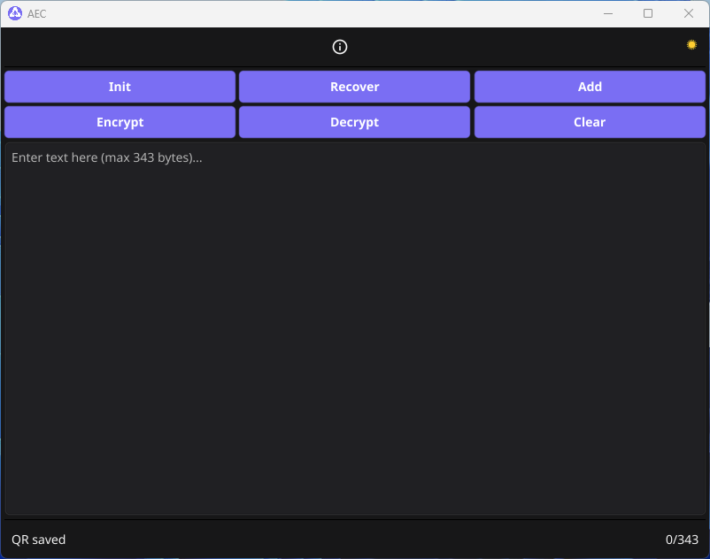
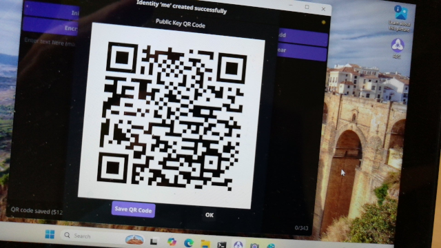
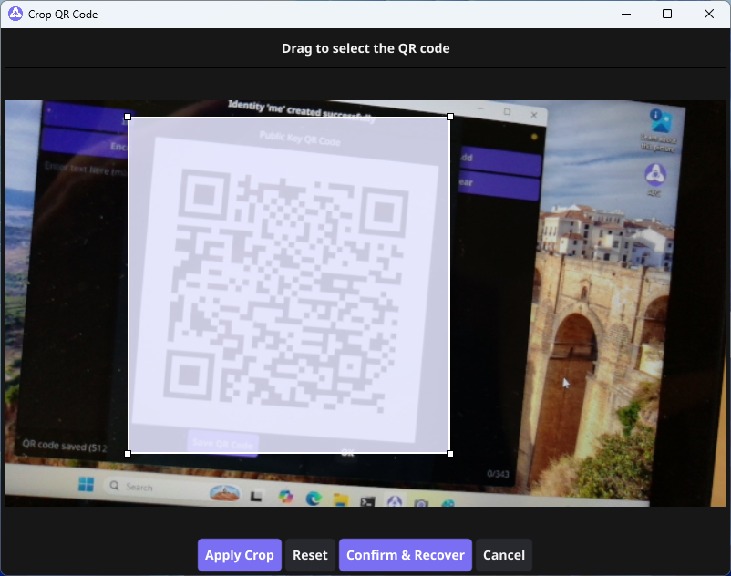
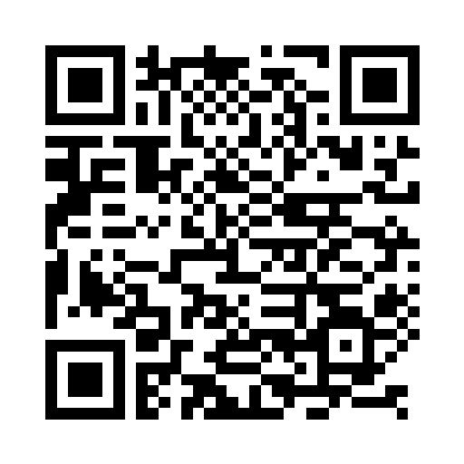

## AEC - Air Gapped Encrypted Communications  

AEC is an easy to use GUI program, allowing  
you to securely communicate with the help  
of an air gapped PC and a Webcam to your  
online PC.  

# Creating a NaClbox key pair with Init  



# Capturing the QR-Code  



# Recovering the QR-Code  



# Final result  



As you can see, you always have to use the  
Recover button once your camera captured  
the QR-Code.

For sending AEC QR-Codes as emails, I highly
recommend to use the [Hermes Nym Mixnet email Gateway](https://n2m.oc2mx.net).

NaClbox is used for public key encryption.  

If you like AEC consider a small donation    
in crypto currencies or buy me a coffee.  
```
Nym: n1f0r6zzu5hgh4rprk2v2gqcyr0f5fr84zv69d3x          
```
<a href="https://www.buymeacoffee.com/Ch1ffr3punk" target="_blank"></a>

AEC is dedicated to Alice and Bob.
